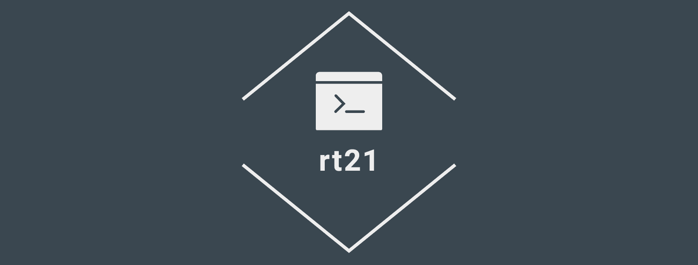
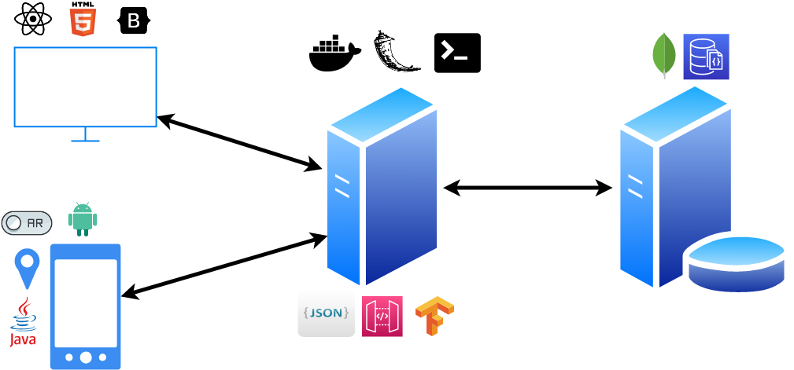
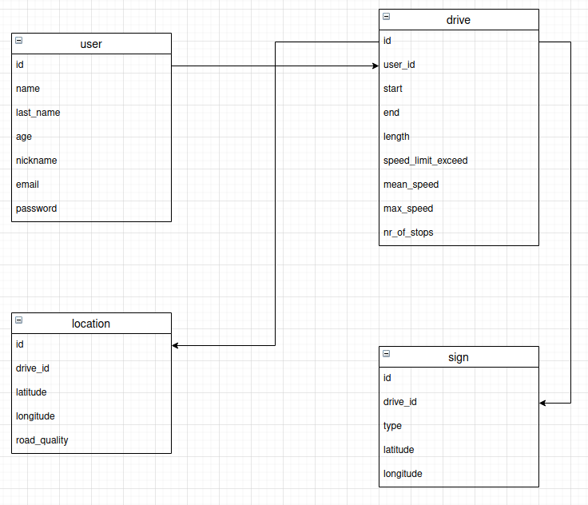
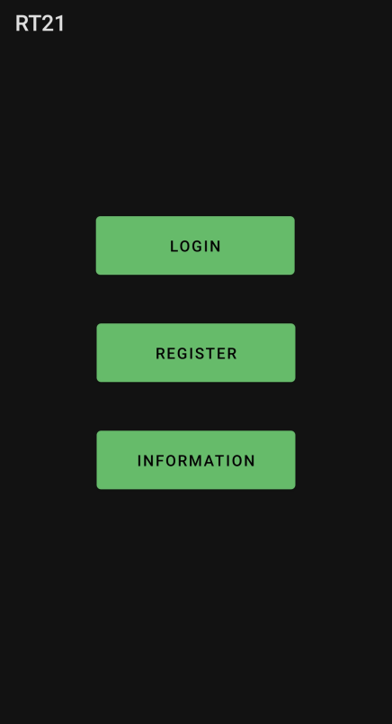
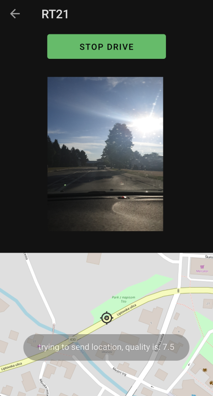
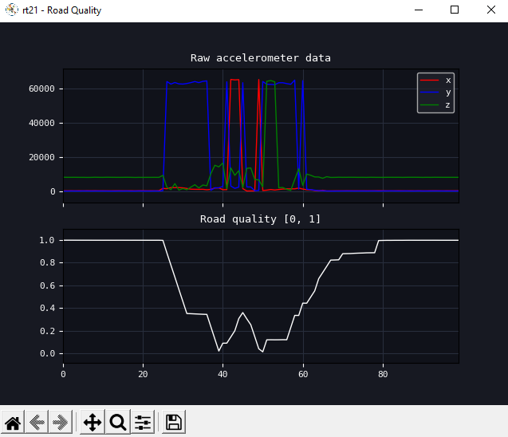
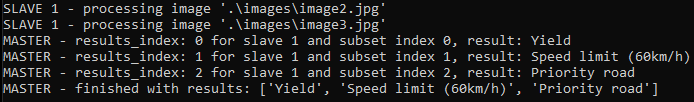

<div align="center">
  
</div>

# Table of Contents

- [Table of Contents](#table-of-contents)
- [About](#about)
- [Server](#server)
- [Database](#database)
- [API](#api)
- [Android app](#android-app)
- [Computer vision](#computer-vision)
- [Website](#website)
- [Documents](#documents)
- [Security and portability](#security-and-portability)
- [STM32 Discovery](#stm32-discovery)
- [Data compression algorithm](#data-compression-algorithm)
- [Parallel app](#parallel-app)
- [AR app](#ar-app)

# About

Project at big data analysis for real-world applications at FERI, 2nd and 3rd year, CS. The project theme was traffic. The android application takes the camera feed and sends that image to API for road signs recognition. The android app also uses GPS to track location, monitors mean and max speed, and detects vibration to determine road quality. API stores all essential info in the database. The website displays stored data and other statistical info to the user.

<br>
The project consists of 5 main components: database, API, website, android application and AR app as shown in the following image and table:
<div align="center">
  
</div>

<br>

| Project section | Technologies used         |
| --------------- | ------------------------- |
| Server          | Docker, bash              |
| Database        | MongoDB                   |
| API             | Flask                     |
| Android app     | Java                      |
| Computer vision | OpenCV, TensorFlow, Keras |
| Website         | HTML5, Bootstrap, React   |
| Documents       | LaTeX                     |
| STM32 Discovery | C, Python                 |
| Algorithm       | Python                    |
| Parallel        | Python                    |
| AR app          | Unity, Blender            |

# Server

<div align="center">
  
  
  
  
  
  
  
  
  
</div>

For website and API hosting, we choose [Heroku](https://www.heroku.com). Both applications are running inside docker containers, and by doing that, we achieve effortless transfer to another hosting provider in case of necessity. By using Heroku, all apps automatically get support for HTTPS protocol. For the web server, we choose Nginx.

Contributor:

<table>
    <tbody>
        <tr>
            <td align="center">
                <a href="https://github.com/david-slatinek" target="_blank">
                    
                    <br/>
                    <sub><b>David Slatinek</b></sub>
                </a>
            </td>
        </tr>
    </tbody>
</table>

# Database

<div align="center">
 
 
 
</div>

For the database, we choose the NoSQL database type, specifically MongoDB. The database is being hosted by [MongoDB Atlas](https://www.mongodb.com/cloud/atlas). In the database, we store information about the user, his drives, the locations of these drives, and information about traffic signs.

Collections can be seen from the following image:

<div align="center">
  
</div>

Contributor:

<table>
    <tbody>
        <tr>
            <td align="center">
                <a href="https://github.com/david-slatinek" target="_blank">
                    
                    <br/>
                    <sub><b>David Slatinek</b></sub>
                </a>
            </td>
        </tr>
    </tbody>
</table>

# API

<div align="center">
  
  
  
  
</div>

The API serves as an intermediate link between the clients and the database. It limits unauthorized access to the database and makes the development of front-end applications simpler, as the developers working on it are not involved in retrieving data from the database, but instead retrieve it in a specific format and then use it in further development.

The API was made with python framework **flask**, follows the REST architectural style, and returns data in JSON format. On the security aspect, the system contains the following security mechanisms:

1. API key.
2. HTTPS protocol.

One of the methods:

```python
@app.route('/api/user/<user_id>', methods=['GET'])
def app_get_user(user_id):
    if request.headers.get('X-API-Key') != app.config['API_KEY']:
        return create_response("error", "api key not given or invalid", 401)
    return get_user(user_id)
```

The API supports all CRUD operations and can also identify traffic signs from a picture.

Contributor:

<table>
    <tbody>
        <tr>
            <td align="center">
                <a href="https://github.com/david-slatinek" target="_blank">
                    
                    <br/>
                    <sub><b>David Slatinek</b></sub>
                </a>
            </td>
        </tr>
    </tbody>
</table>

# Android app

<div align="center">
  
  
  
</div>

Android app was made with Java. The main app functionality is an image and data capture from sensors and sending them to the server. The app uses GPS to track location and detects vibration to determine road quality. In addition to that, the app also monitors mean and max speed.

<div align="center">
  
  
</div>

Contributor:

<table>
    <tbody>
        <tr>
            <td align="center">
                <a href="https://github.com/iskraM" target="_blank">
                    
                    <br/>
                    <sub><b>Marcel Iskrač</b></sub>
                </a>
            </td>
        </tr>
    </tbody>
</table>

# Computer vision

<div align="center">
  
  
  
  
  
</div>

For traffic sign recognition, we made a program with a convolutional neural network. The program is called by API when it receives an appropriate request.

```python
prediction = model.predict(img)
index = np.argmax(prediction)
return class_names[index]
```

```python
from detect_road_sign import recognize
return create_response('sign_type', recognize('image' + file_ext), 200)
```

Contributor:

<table>
    <tbody>
        <tr>
            <td align="center">
                <a href="https://github.com/iskraM" target="_blank">
                    
                    <br/>
                    <sub><b>Marcel Iskrač</b></sub>
                </a>
            </td>
        </tr>
    </tbody>
</table>

# Website

<div align="center">
  
  
  
  
  
</div>

The website was created using the React library, HTML and CSS, and Boostrap, which was used for effortless design. We used React for the layout and calls to the application components and communication between the API and the website. The main website functionality is data visualization.


Contributor:

<table>
    <tbody>
        <tr>
            <td align="center">
                <a href="https://github.com/iskraM" target="_blank">
                    
                    <br/>
                    <sub><b>Marcel Iskrač</b></sub>
                </a>
            </td>
        </tr>
    </tbody>
</table>

# Documents

<div align="center">
  
  
</div>

All documents were written with [LaTeX](https://www.latex-project.org/) on [Overleaf](https://www.overleaf.com/).
We choose LaTeX due to the following advantages:

- Appealing documents
- Superb and consistent management of internal references and citations
- Separation of content and style
- Flexibility - a lot of packages

All documents are available [here](/documents).

Contributor:

<table>
    <tbody>
        <tr>
            <td align="center">
                <a href="https://github.com/david-slatinek" target="_blank">
                    
                    <br/>
                    <sub><b>David Slatinek</b></sub>
                </a>
            </td>
        </tr>
    </tbody>
</table>

# Security and portability

Data security is of paramount importance in any project. For this purpose, we use the HTTPS protocol for all parts of the project, and user passwords are stored as hashes in the database. By using Docker, we achieve portability.
The following table shows the security of the project and the portability of a specific part:

| Project part | Security                          | Portability               |
| ------------ | --------------------------------- | ------------------------- |
| Server       | Service provider, HTTPS           | Yes, docker               |
| Database     | Service provider, accounts, HTTPS | Yes, data transfer        |
| API          | Service provider, API keys, HTTPS | Yes, docker               |
| Android app  | HTTPS                             | No, only Android platform |
| Website      | Service provider, HTTPS           | Yes, docker               |

# STM32 Discovery

<div align="center">
  
  
</div>

We used an accelerometer on the SMT32 Discovery board for simulating road quality values. We then made a python script to get data from it and to visualize it.

<div align="center">
  
</div>

Contributor:

<table>
    <tbody>
        <tr>
            <td align="center">
                <a href="https://github.com/VidKreca" target="_blank">
                    
                    <br/>
                    <sub><b>Vid Kreča</b></sub>
                </a>
            </td>
        </tr>
    </tbody>
</table>

# Data compression algorithm

<div align="center">
    
    
</div>

We made an algorithm for compressing road quality numbers with python. When the API receives an appropriate request, it gets all road quality data from the database and compresses it into a binary file, which he then sends to the client. The client can then perform decompression and uses the data in further analysis.

```python
if rule == 0:
    bits = get_rule_0_bits(number)
    result += str('{0:b}'.format(bits - 2).zfill(2))
    result += str('{0:b}'.format(get_rule_0_value(number))).zfill(bits)
elif rule == 1:
    counter = 0
    while counter < 8:
        if len(numbers_2) == 0:
            break
        value = numbers_2.pop(0)
        if value != 0:
            numbers_2.insert(0, value)
            break
        counter += 1
    result += str('{0:b}'.format(counter)).zfill(3)
elif rule == 10:
    result += "1" if number < 0 else "0"
    result += str('{0:b}'.format(abs(number)).zfill(8))
```

Contributor:

<table>
    <tbody>
        <tr>
            <td align="center">
                <a href="https://github.com/david-slatinek" target="_blank">
                    
                    <br/>
                    <sub><b>David Slatinek</b></sub>
                </a>
            </td>
        </tr>
    </tbody>
</table>

# Parallel app

<div align="center">
    
</div>

To achieve higher performance, we used Open MPI for image processing. The main program receives the request and the images, distributes them to the other computers, and then receives their responses.

<div align="center">
  
</div>

<table>
    <tbody>
        <tr>
            <td align="center">
                <a href="https://github.com/VidKreca" target="_blank">
                    
                    <br/>
                    <sub><b>Vid Kreča</b></sub>
                </a>
            </td>
            <td align="center">
                <a href="https://github.com/iskraM" target="_blank">
                    
                    <br/>
                    <sub><b>Marcel Iskrač</b></sub>
                </a>
            </td>
        </tr>
    </tbody>
</table>

# AR app

<div align="center">
    
    
</div>

We made traffic signs with Blender and we used Unity to make an AR app. The app uses GPS location to get the closest traffic sign and the closest road quality.

<div align="center">
  
</div>

<table>
    <tbody>
        <tr>
            <td align="center">
                <a href="https://github.com/iskraM" target="_blank">
                    
                    <br/>
                    <sub><b>Marcel Iskrač</b></sub>
                </a>
            </td>
        </tr>
    </tbody>
</table>
