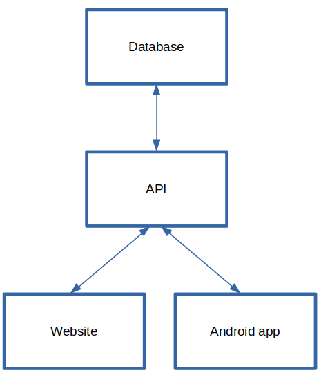
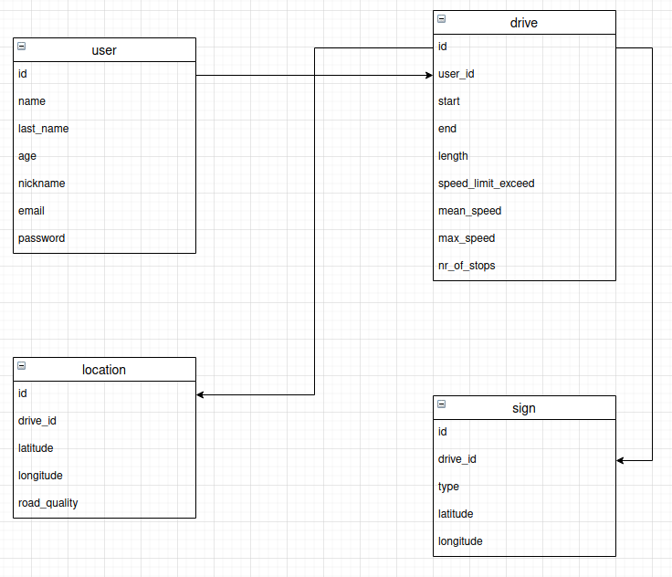
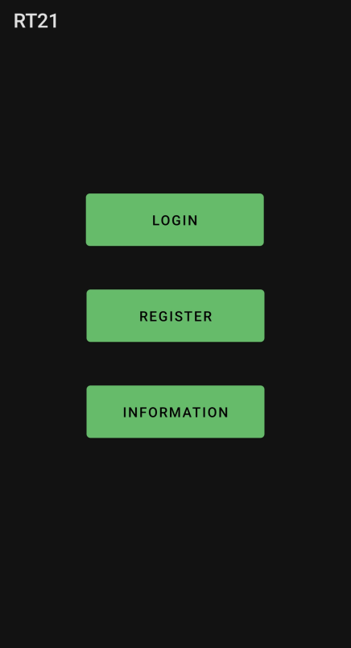

# rt21

<p>
    
    
    
    
    
    
    
    
    
    
    
    
    
    
    
    
    
    
    
    
    
    
    
    
    
</p>

# About
Project at big data analysis for real-world applications at FERI, 2nd year, CS. The project theme was traffic. The android application takes camera feed and sends that image to API for road signs recognition. Android app also uses GPS to track location and detects vibration to determine road quality. API stores all essential info in the database. The website displays stored data and other statistical info to the user.

<br>
The project consists of 4 main components: database, API, website and android application as shown in the following image and table:

<p align="center">
  
</p>

<br>

| Project section | Technologies used         |
| --------------- | ------------------------- |
| Server          | Docker, bash              |
| Database        | MongoDB                   |
| API             | Flask                     |
| Android app     | Java                      |
| Computer vision | OpenCV, TensorFlow, Keras |
| Website         | HTML5, Bootstrap, React   |
| Documents       | Latex                     |

# Table of Contents
- [Server](#server)
- [Database](#database)
- [API](#api)
- [Android app](#android-app)
- [Computer vision](#computer-vision)
- [Website](#website)

# Server
For website and API hosting, we choose [Heroku](https://www.heroku.com). Both applications are running inside docker containers, and by doing that, we achieve effortless transfer to another hosting provider in case of necessity. By using Heroku, all apps automatically get support for HTTPS protocol. For the web server, we choose Nginx.

Contributor: [David Slatinek](https://github.com/david-slatinek).

# Database
For the database, we choose the NoSQL database type, specifically MongoDB. The database is being hosted by [MongoDB Atlas](https://www.mongodb.com/cloud/atlas). In the database, we store information about the user, his drives, the locations of these drives, and information about traffic signs.

Collections can be seen from the following image:
<p align="center">
  
</p>

Contributor: [David Slatinek](https://github.com/david-slatinek).

# API
The API serves as an intermediate link between the clients and the database. It limits unauthorized access to the database and makes the development of front-end applications simpler, as the developers working on it are not involved in retrieving data from the database, but instead retrieve it in a specific format and then use it in further development.

The API was made with python framework flask, follows the REST architectural style, and returns data in JSON format. On the security aspect, the system contains the following security mechanisms:
1. API key.
2. HTTPS protocol.

One of the methods:
```python
@app.route('/api/user/<user_id>', methods=['GET'])
def get_user(user_id):
    if request.headers.get('X-API-Key') != api_key:
        return create_response("error", "api key not given or invalid", 401)
    return user.get_user(user_id)
```

The API supports all CRUD operations and can also identify traffic signs from a picture.

Contributor: [David Slatinek](https://github.com/david-slatinek).

# Android app
Android app was made with java. The main app functionality is an image and data capture from sensors and sending them to the server. The app uses GPS to track location and detects vibration to determine road quality. In addition to that, the app also monitors speed.

<p align="center">
  
</p>

Contributors: [Marcel Iskrač](https://github.com/iskraM), [Marko Hiršel](https://github.com/markoHirsel).

# Computer vision 
For traffic sign recognition, we made a program with a convolutional neural network. The program is called by API when it receives an appropriate request.

```python
prediction = model.predict(img)
index = np.argmax(prediction)
return class_names[index]
```

```python
from detectRoadSign import recognize
return main.create_response('sign_type', recognize("image" + file_ext), 200)
```

Contributor: [Marcel Iskrač](https://github.com/iskraM).

# Website
The website was created using the React library, HTML and CSS, and Boostrap, which was used for easy design. We used React for the layout and calls to the application components and for communication between the API and the website. The main website functionality is data visualization.


Contributor: [Marcel Iskrač](https://github.com/iskraM).
